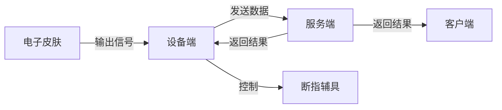
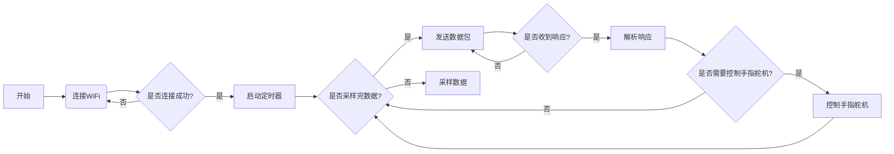
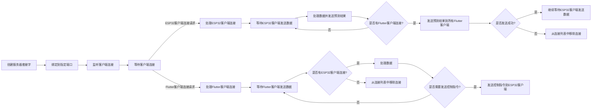
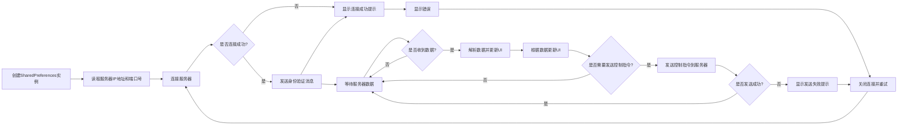

# 断指-电子皮肤

## 系统框架流程

1. 信号读取

使用 ESP 32 的 ADC 外设读取电极输出的电压，截取一段原始电压数据进行打包，并通过 socket 通信向服务器公网 IP 发送。

2. 信号处理

服务器通过 socket 通信接收 ESP 32 发送过来的原始电压数据，对其进行特征值提取，随后即将特征值输入分类模型内对其进行分类，分类结果通过 socket 通信发送到 Flutter 客户端和 ESP 32 设备端。

3. 结果输出

在 Flutter 客户端 APP 通过 socket 通信接收来自服务端的分类结果，并切换对应图片进行直观展示，同时 ESP 32 设备端也会接收来自服务端的结果，并驱动对应舵机带动手指。

系统流程图如下：

开发环境：
设备端：ESP 32 DevkitC-1 开发板
服务端：Microsoft Azure 虚拟机（Ubuntu 系统）
客户端：Flutter 跨平台框架

下面将详细介绍各模块设计与实现。

## 设计与实现

### 设备端

[电子皮肤/断指ESP32程序](https://github.com/huigang39/eskin_esp32)

该模块使用 PlatformIO 开发，若使用 Arduino IDE 复现或二次开发本模块，将 `src` 文件夹中的 `main.cpp` 改为 `main.ino` 即可编译。

> 如果安装时，舵机绑线位置不对，可以通过修改舵机初始角度和转动角度在软件层面调整。

程序逻辑图如下：

### 服务端

[电子皮肤/断指服务端程序](https://github.com/huigang39/eskin_server)

该模块主要分为两个部分：

第一部分是训练模型，主要通过 `sklearn` 中的随机森林分类器来对 `data` 文件夹下的数据进行训练，并输出模型到 `model` 文件夹。

第二部分是部署模型，该部分通过接收设备端的原始数据，通过 `server.py` 处理并返回模型的输出分类标签到设备端和客户端。

程序逻辑图如下：

### 客户端

[电子皮肤/断指Flutter程序](https://github.com/huigang39/eskin_flutter)

该模块使用 Flutter 跨平台软件开发框架，不推荐复现本模块，因为环境配置较为繁琐。

程序逻辑图如下：

